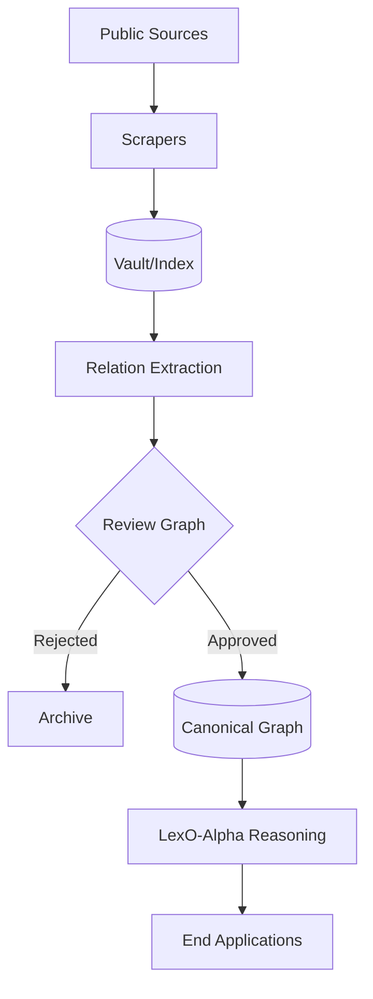

# 🏗️ Architecture & Core Philosophy

Legal analysis requires more than simple document retrieval. In the Chilean legal system, practitioners need explicit **legal structure**: which sources relate to which claims, under what role, and with what evidence. 

Our **Legal Knowledge Graph (LKG)** models entities and relations as inspectable objects rather than implicit text patterns.

---

## 📊 The 7-Layer Stack

| Layer | Name | Primary Responsibility |
| :--- | :--- | :--- |
| **0** | **Scrapers** | Data acquisition via PJUD, DT, SUSESO, and BCN (LeyChile). |
| **1** | **IndexO** | Semantic retrieval with fine-tuned BETO (Chilean Legal QA). |
| **2** | **Reviewer** | Human-in-the-loop curation and goldset construction. |
| **3** | **Review Graph** | State machine for relation validation (PENDING → APPROVED). |
| **4** | **LKG (Canonical)** | The source of truth. Verified edges with hash-based evidence. |
| **5** | **LexO-Alpha** | Multi-agent reasoning (NIFs) and orchestration. |
| **6** | **Applications** | Products: Procurador-digital, Lexito, Case Writer. |

---

## ⚖️ System Pillars

### 1. Canonicalization as Core Control
Canonicalization provides reproducible text units and stable references used downstream. This ensures **evidence traceability**: every claim made by an agent can be traced back to a specific version of a document in the vault.

### 2. Human-Centric Validation
Human review is integrated into the architecture, not treated as optional. The **Review Graph** acts as a buffer; ambiguous legal edges are manually reviewed before they enter high-confidence answer paths.

### 3. Fail-Closed Answer Path
Answer generation is strictly constrained by evidence availability and review status. If the support from the Canonical Graph is insufficient, the system knows to **abstain** rather than hallucinate.

### 4. Semantic Intelligence
We don't use generic models for search. **IndexO** uses a transformer-based encoder (BETO) specifically trained on the nuances of Chilean administrative and judicial language.

---

## 🔄 Data Flow Protocol

